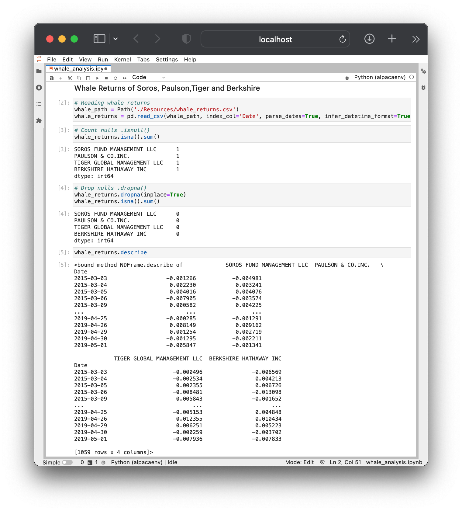
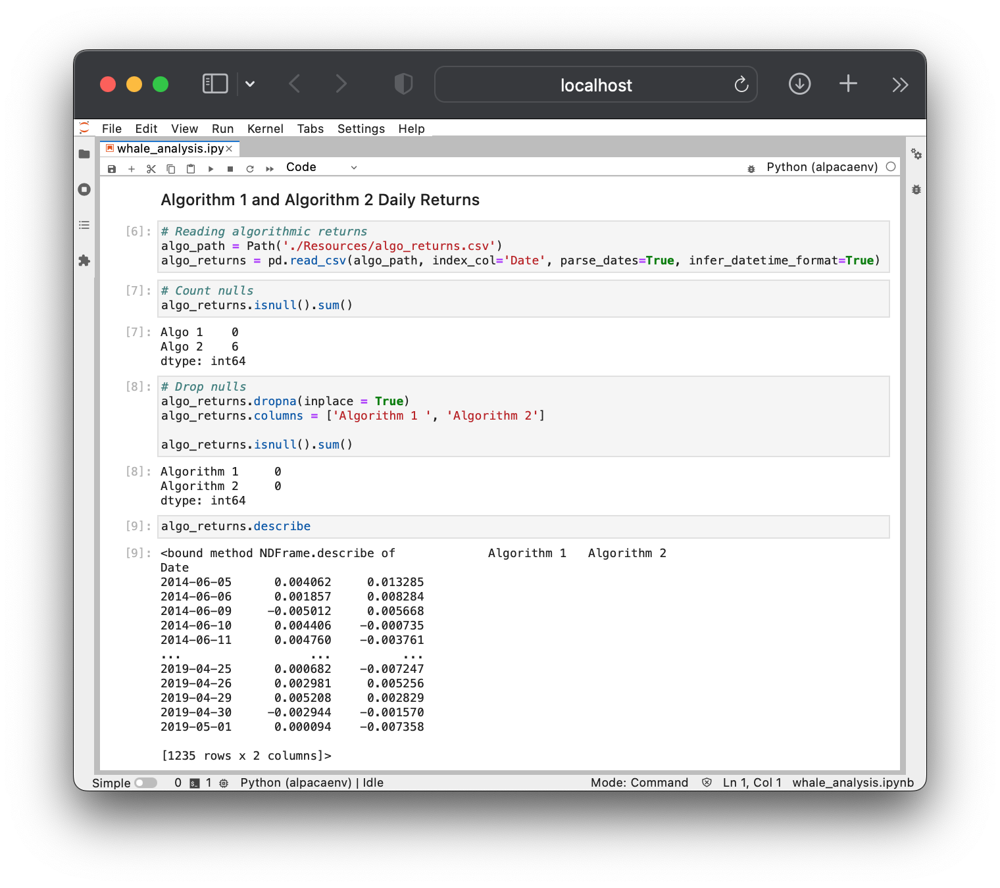
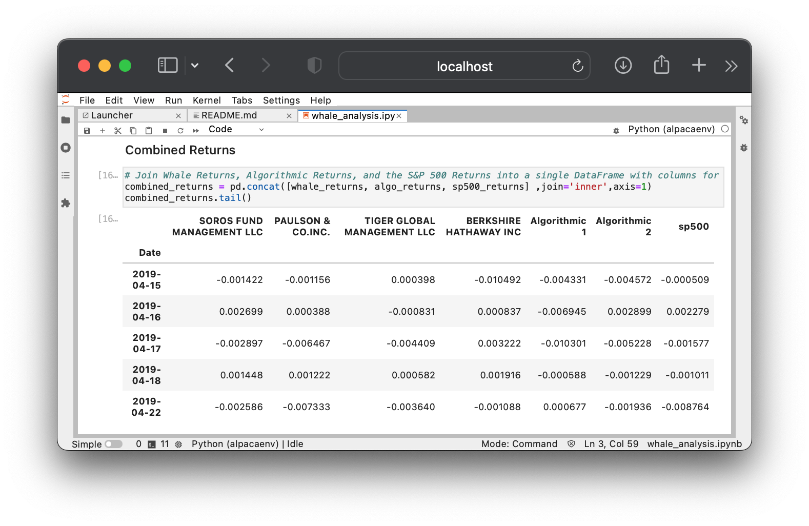
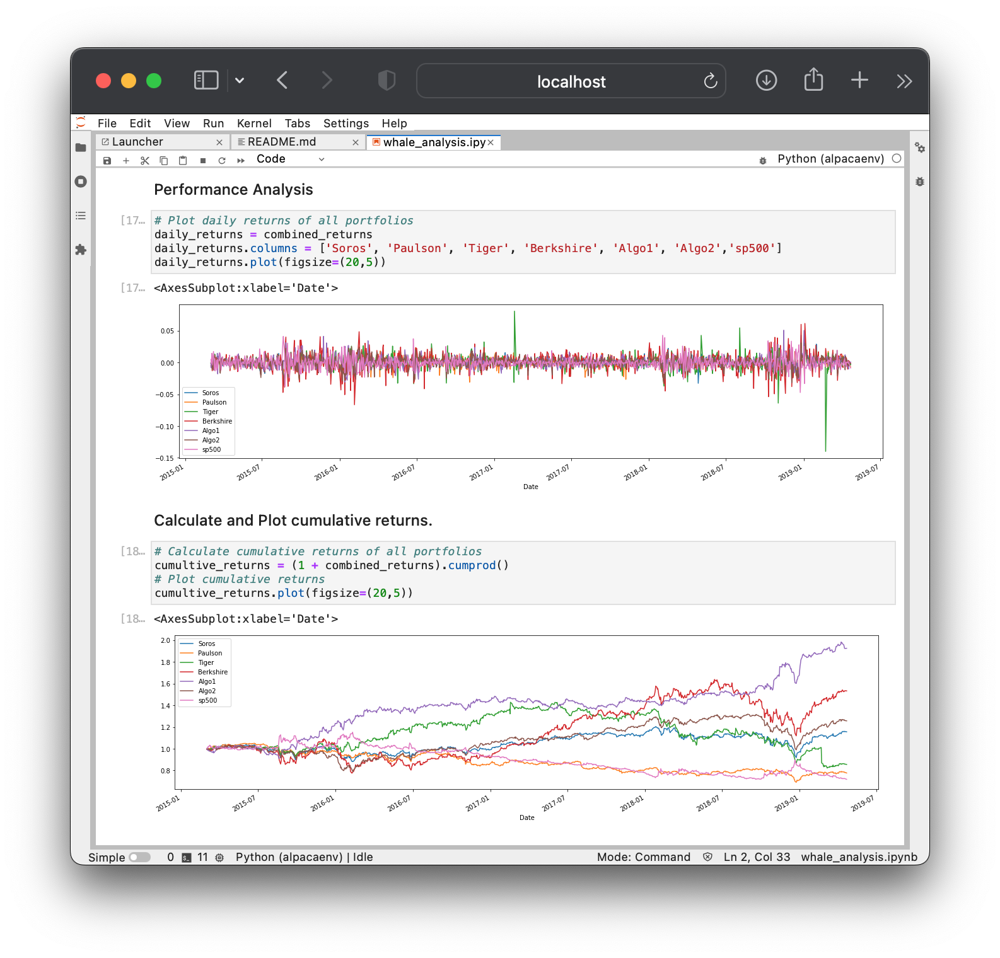
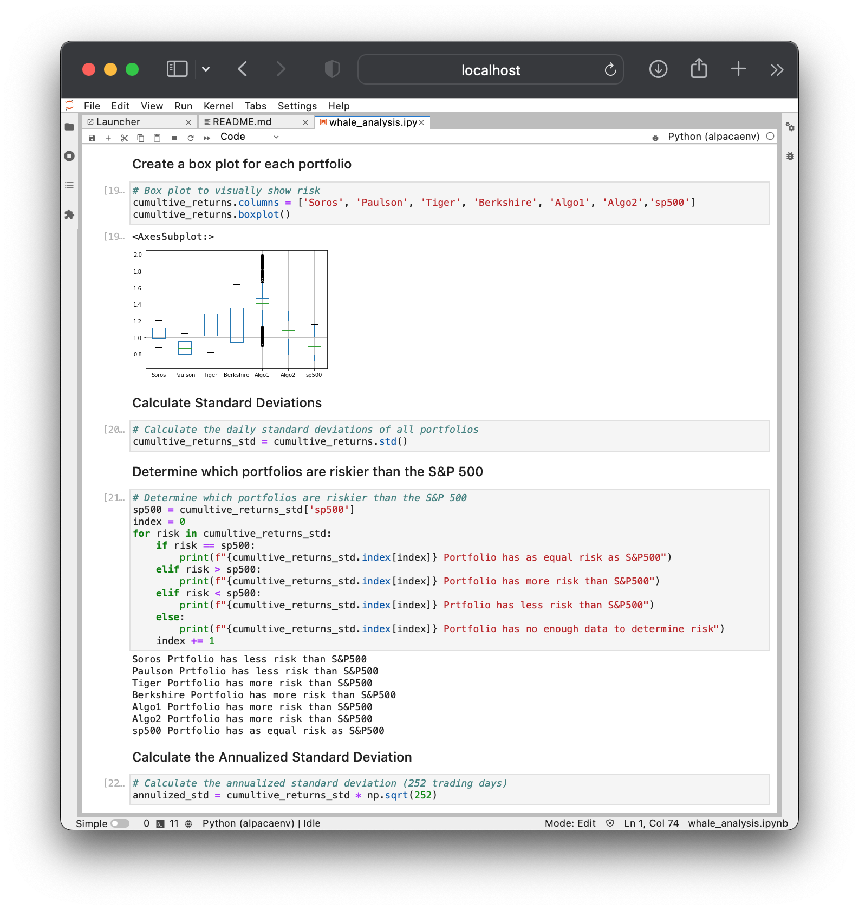
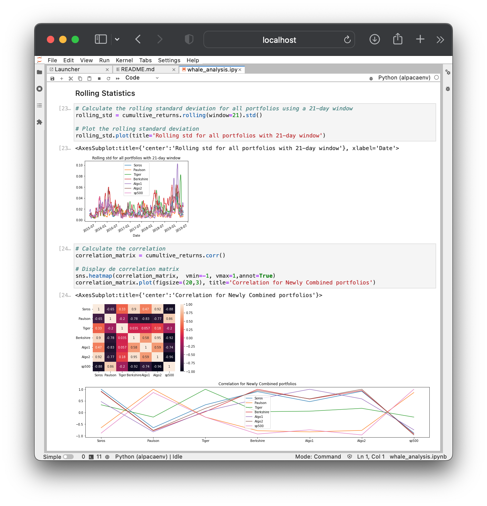
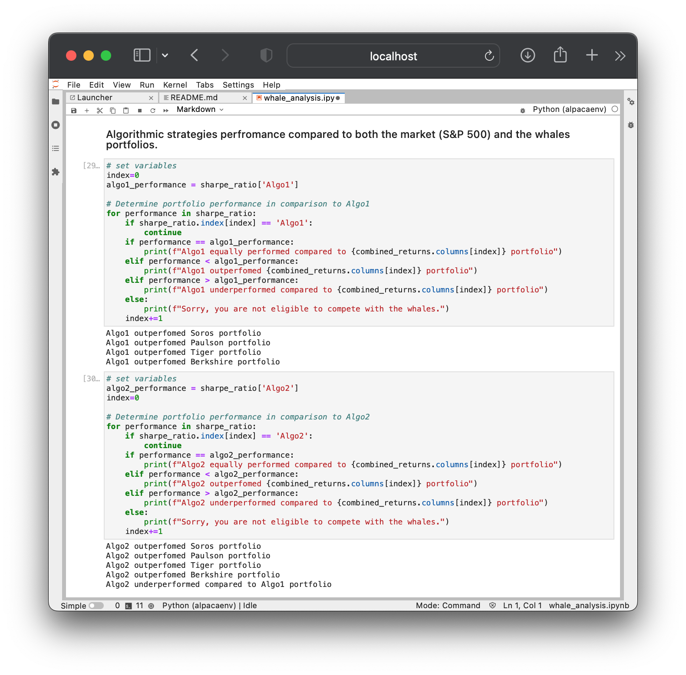
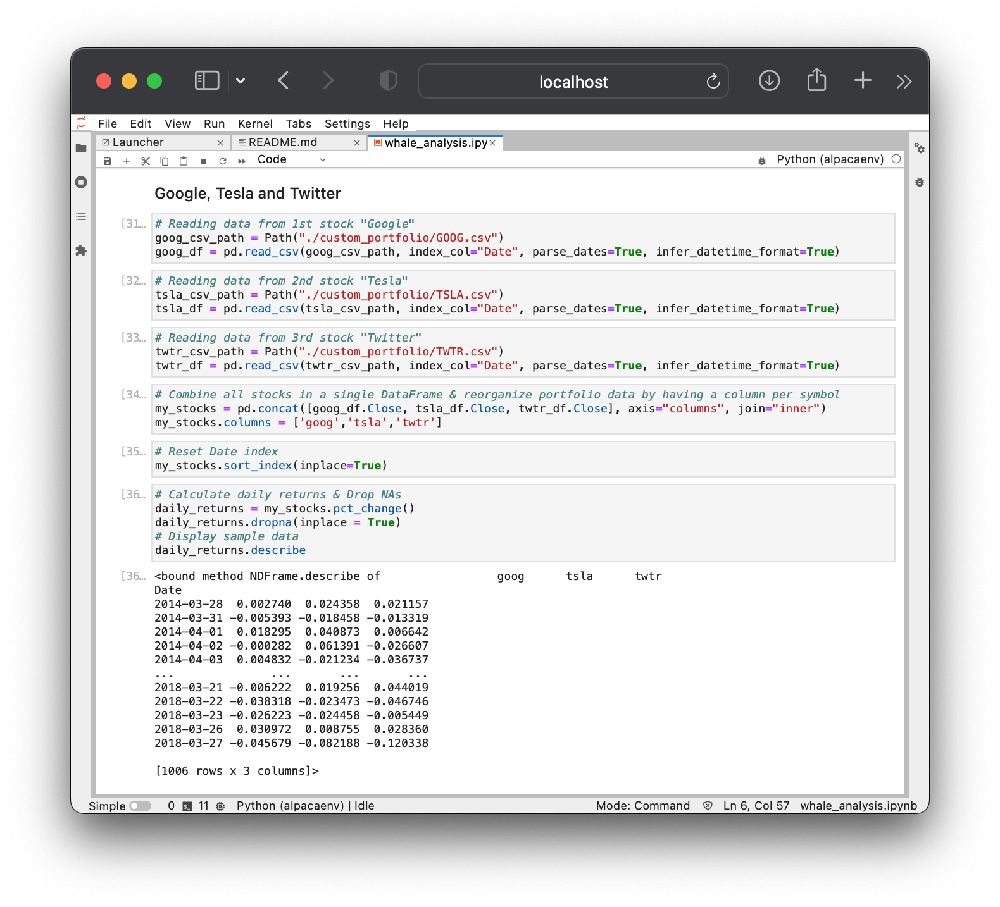
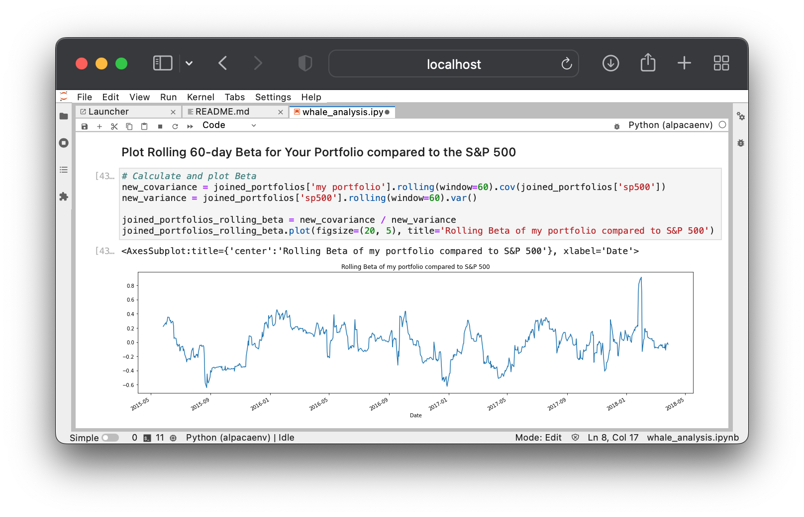
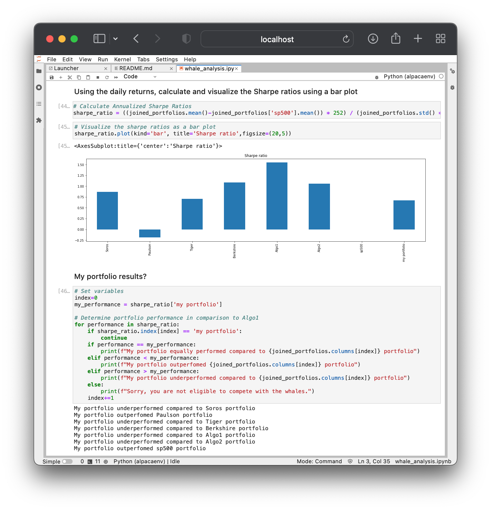

# 🐳 A Whale Portfolio analysis

# Table of Contents
1. [Background](#-1-background)
2. [My Analysis](#-2-my-analysis)
3. [Results](#%EF%B8%8F-3-results)

## [🚧 1. Background](#🚧-1-background)

* Using Python and Pandas, determine which portfolio is performing the best across multiple areas:
    * volatility
    * returns
    * risk 
    * Sharpe ratios
* This python code compares [my custom portfolio](/custom_portfolio/) to [the whales](/Resources/whale_returns.csv) and [two alogorithmic trading strategies](/Resources/algo_returns.csv)
* This code compares if my custom portfolio: 
    * Outperforms
    * Underperforms 
    * Or Equally perfroms 

## [🚦 2. My Analysis](#🚦-2-my-analysis)
* Analyze whale Returns of Soros, Paulson,Tiger and Berkshire 
    * Read the Whale Portfolio daily returns and clean the data 
    
* Analyze Algorithm 1 and Algorithm 2 Daily Returns
    * Read the algorithmic daily returns and clean the data
    
* S&P 500 Returns
    * Read the S&P 500 historic closing prices and create a new daily returns DataFrame from the data.
    
* Combine Returns
    
* Performance Analysis
    * Calculate and Plot the daily returns.
    * Calculate and Plot cumulative returns.
    
* Risk analysis:
    * Create a box plot for each portfolio.
    * Calculate the standard deviation for all portfolios
    * Determine which portfolios are riskier than the S&P 500
    * Calculate the Annualized Standard Deviation
    
* Rolling Statistics.
    * Calculate and plot the rolling standard deviation for all portfolios using a 21-day window
    * Calculate the correlation between each stock to determine which portfolios may mimick the S&P 500
    
    * Choose one portfolio, then calculate and plot the 60-day rolling beta between it and the S&P 500
    * Calculate and Plot Beta for a chosen portfolio and the S&P 500
        *  Try calculating the `ewm` with a 21-day half life for each portfolio, using standard deviation (std) as the metric of interest. 
        
* Sharpe ratio analysis
    * Calculate the Sharpe ratios and generate a bar plot
    
* Determine whether the algorithmic strategies outperform both the market (S&P 500) and the whales portfolios.

* Create Custom Portfolio
    * Choose 3-5 custom stocks with at last 1 year's worth of historic prices and create a DataFrame of the closing prices and dates for each stock.
    
    * Calculate the weighted returns for the portfolio assuming an equal number of shares for each stock
        * Join your portfolio returns to the DataFrame that contains all of the portfolio returns
        
    * Calculate the Annualized Standard Deviation.
    * Calculate and plot rolling `std` with a 21-day window.
    * Calculate and plot the correlation.
    * Calculate and plot beta for your portfolio compared to the S&P 60 TSX.
        

* Calculate the Sharpe ratios and generate a bar plot.
    * How does my portfolio do?
    
    
## [🛣️ 3. Results](#🛣️-3-results)
* **File:** [Whale Analysis](./whale_analysis.ipynb)

